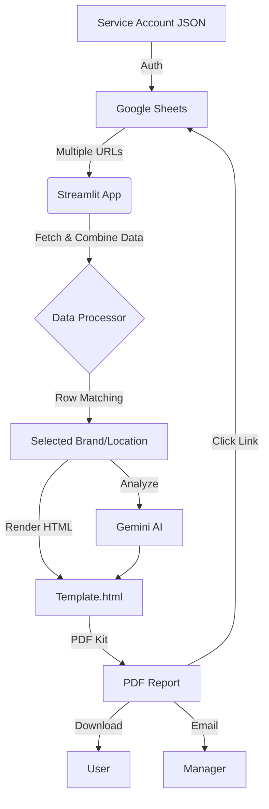

# Kytchens Intelligence: Report Portal 🚀

A professional, AI-powered kitchen performance reporting system built with **Streamlit**, **Google Sheets**, and **Gemini AI**.


## 📊 System Workflow


## 🌟 Key Features
- **🌐 Multi-Sheet Sync**: Connect to multiple Google Sheets simultaneously and combine data in real-time.
- **🍎 Apple-Style Design**: Beautiful, pill-style PDF reports optimized for mobile and desktop viewing.
- **✉️ Bulk Automation**: Generate and email individualized PDF reports to dozens of managers with a single click.
- **📊 Interactive Dashboard**: Filter by brand and location to audit specific kitchen performance.
- **🔗 Direct Auditing**: Every PDF report contains a direct, clickable link to the exact source spreadsheet.

## 🚀 Quick Start (Local)

1. **Clone the repository**:
   ```bash
   git clone https://github.com/anirudh903/report-generator.git
   cd report-generator
   ```

2. **Install Dependencies**:
   ```bash
   pip install -r requirements.txt
   ```

3. **Install wkhtmltopdf**:
   - Download and install [wkhtmltopdf](https://wkhtmltopdf.org/downloads.html).
   - Ensure it is added to your System PATH (or use the automatic detection built into `main.py`).

4. **Setup Secrets**:
   Create a `.streamlit/secrets.toml` file with your credentials:
   ```toml
   GEMINI_API_KEY = "your_key"
   EMAIL_USER = "your_email@gmail.com"
   EMAIL_PASS = "your_app_password"

   [connections.gsheets]
   # Paste your service account JSON contents here
   ```

5. **Run the App**:
   ```bash
   streamlit run streamlit_app.py
   ```

## ☁️ Deployment on Streamlit Cloud

1. Push your code to GitHub.
2. Connect the repo to [Streamlit Cloud](https://share.streamlit.io).
3. **Important**: Add your `secrets.toml` content into the **Advanced Settings > Secrets** box on the Streamlit dashboard.
4. The app will automatically read `packages.txt` to install `wkhtmltopdf` on the cloud server.

## 📂 Project Structure
- `streamlit_app.py`: The main web interface.
- `main.py`: Core logic for data processing and PDF generation.
- `template.html`: The premium Apple-style HTML template for reports.
- `packages.txt`: System dependencies for linux containers (wkhtmltopdf).
- `requirements.txt`: Python package dependencies.

## 🤖 Automations (GitHub Actions)
The repository includes a **Weekly Auto-Email** workflow (`.github/workflows/weekly_email.yml`) that can be scheduled to automatically send reports every Monday morning.

---
**Developed by Kytchens Intelligence Unit**
